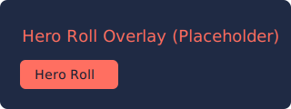
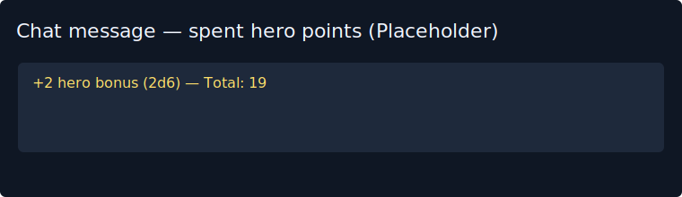

# RNK Hero Forge

Foundry VTT module (initial scaffold) to manage "Hero Points" for players.

- Features (v0.1):
- World settings for default max/current hero points and hero die.
- Actor flag API to get/set/add/spend hero points (`game.rnk.heroPoints`).
- A GM/Player Hub UI to view and manage actor hero points (`HeroHub`).
- A small button rendered on roll chat messages allowing players to spend hero points; the module creates a chat message showing the bonus, emits a hook `rnk-hero-forge.applyHeroBonus` for integrations, and now applies pending bonuses to every DND5e roll chat message (combat or not) before the message is created, even if `midi-qol` is enabled.
  - UI behavior: the Hub lists actors depending on role:
    - GM Hub: shows only player characters (PCs) — NPCs are excluded.
    - Player Hub: shows only the player's own actors (so players don't see GM-only rows).
    - Sidebar behavior: when opened using the Sidebar button, the Hub shows a per-user view — players see only the actors they own (no GM/other players' rows).
  - Chat button: only appears for messages linked to an Actor and to the message author (or GM); it no longer appears for actor-less messages.
    - Visual refresh: Hub rows are now card-like with improved spacing, responsive layout, and clearer action buttons. Players and GMs have a clearer header denoting the view.
- Modular file layout: each feature in its own file, separate templates and styles.

## Installation

1. Copy this folder into Foundry's `Data/modules/` directory.
2. Restart Foundry, go to **Manage Modules**, enable `RNK Hero Forge` and configure settings under **Module Settings**.
3. For players: enable the `Enable Player Hub` setting to show the hub and overlay controls for non-GMs.

## Quick Start

- Open the Hero Hub from the sidebar button or the scene controls; use **Spend & Roll** to pick points and the target roll.
- Use the floating **Hero Roll** overlay for quick spends without opening the hub.
- Click the **Spend** button on chat messages for post-roll spending and pending bonuses.
 
## Screenshots
-----------

Overview:

Overlay & chat:

## Contributing and Releases

- See `CONTRIBUTING.md` for development guidelines and `docs/RELEASE.md` for the release procedure.
- Use `npm run validate` to validate the module and `npm run package` to build the module zip for release.

I initialized a git repository for this project and added integration adapters for `midi-qol` and a defensive adapter for Monk's Active Tile Triggers (MATT) / Monk Tokenbar. The adapters try to apply pending hero bonuses to trap, disarm, attack, and damage workflows and forward a dedicated hook `rnk-hero-forge.mattApplyBonus` so MATT-specific handlers can apply the bonus exactly where needed.

If you maintain a custom sheet and want the hero-point tracker to live next to a particular DOM element, add a placeholder such as `

` (or give an existing container the `.rnk-actor-tracker-anchor` / `.rnk-hero-tracker-anchor` class); the module will append the tracker there before it falls back to the standard header/body slots.
Would you like me to:

- Expand midiQOL integration to be version-aware and support specific workflow shapes you use? If so, tell me which midiQOL version or which other modules (Monk's Tokenbar, MATT) you want explicit adapters for and I’ll extend the integration.
- Add unit tests or a small runtime test harness (e.g., a macro) to simulate spending and show how the bonus is applied?
- Initialize a git repo and make commits, or package a zip manifest for easy installation?
